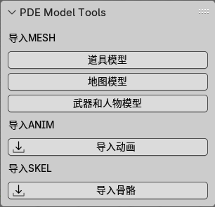
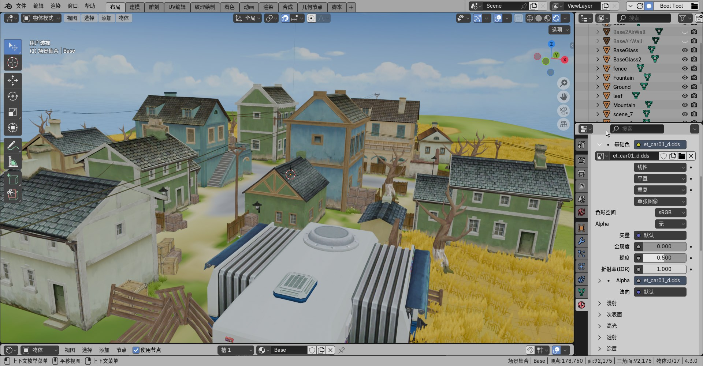
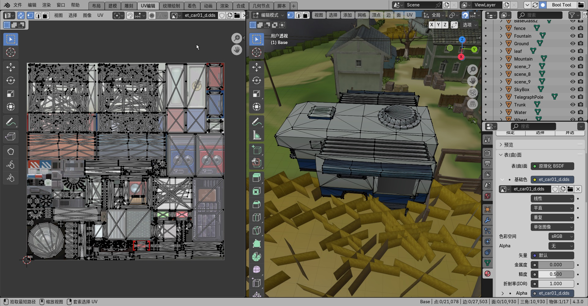
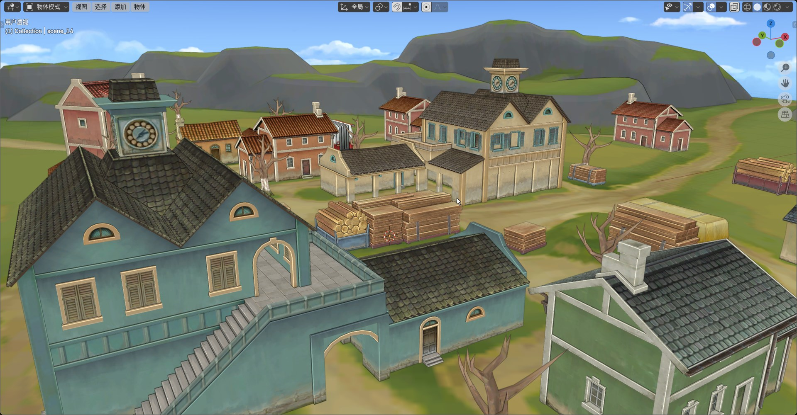

# PDE Model Tools
用于将[PDE](https://baike.baidu.com/item/PDE/32236)游戏引擎中的模型相关文件，导入到Blender(4.2+ )中.

插件还在实现功能中，暂时不考虑优化！

从[UnPdeC](https://github.com/0xletleon/UnPdeC)项目中分离整合而来，仅为学习模型文件格式的目的，请勿用于商业用途！

## 参考
- UV和法线参考了[MeGaMooNie](https://gamebanana.com/members/2429651)写的 [Noesis](https://richwhitehouse.com/index.php?content=inc_projects.php&showproject=91) 脚本 [(Final Combat mesh converter + assets.)](https://gamebanana.com/tools/18783)

## 状态
### ANIM 动画
- [x] 初步识别了动画数据
- [ ] 其他未知数据

### MAP 地图
- [x] 识别顶点
- [x] 识别面
- [x] 识别UV
- [x] 识别法线
- [x] 优化 查找下一个物体头部，能读取更多地图内容。
- [x] 增加 物体使用的贴图名称写到材质中
- [ ] 不正常的变换矩阵数据(比如 performancetest.mesh)
- [x] 反复读取验证了很多有问题的地图,似乎是因为UnPde二次解压有问题导致的！！！
- [ ] 其他未知数据

### PROP 道具
- [x] 识别顶点
- [x] 识别面
- [x] 识别UV
- [x] 识别法线
- [ ] 其他未知数据

### Wapn Character 武器和人物
- [x] 识别顶点
- [x] 识别面
- [x] 识别UV
- [x] 识别法线
- [ ] 其他未知数据

### SKEL 骨骼
- [x] 识别骨骼
- [ ] 其他未知数据

## 建构插件
修改Build.bat中的路径，然后运行即可创建插件。

## 使用插件
需要Blender 4.2+版本

## 位置
VIEW_3D -> UI -> PMT

## 预览
### 能读取地图.mesh中的UV数据

### 读取到的UV

### 能快速找到所使用的贴图名称到材质中
